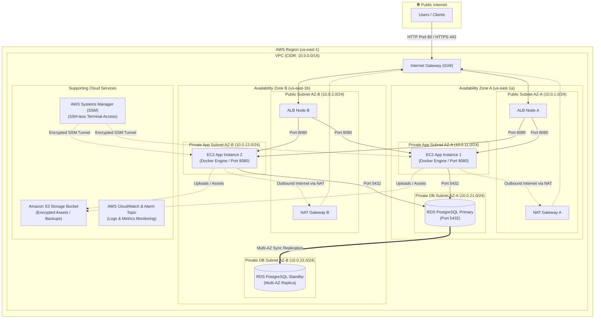

# CloudLab — Multi-AZ 3-Tier Enterprise AWS Infrastructure (Terraform)

[](https://www.terraform.io/)
[](https://aws.amazon.com/)
[](docs/security.md)
[](https://www.docker.com/)
[](https://aws.amazon.com/rds/postgresql/)

**CloudLab** is a production-grade, highly available, and Zero-Trust 3-Tier Cloud Infrastructure blueprint built on **Amazon Web Services (AWS)** using **Terraform (Infrastructure as Code)**. 

Designed following the **AWS Well-Architected Framework**, CloudLab isolates public entrypoints, application container runtimes, and relational database tiers across multiple Availability Zones while enforcing strict IAM principle of least privilege and zero-egress data vaults.

---

## 🏛️ Master Architecture Diagram



---

## Key Engineering & Architectural Highlights

### 1. Zero-Trust 3-Tier Network Isolation & Security Group Chaining
* **Strict Subnet Tiering**: Network is partitioned into 6 subnets across 2 Availability Zones (`us-east-1a`, `us-east-1b`):
  * **Public Subnets (`10.0.1.0/24`, `10.0.2.0/24`)**: Hosts Application Load Balancers and NAT Gateways.
  * **Private App Subnets (`10.0.11.0/24`, `10.0.12.0/24`)**: Hosts EC2 backend containers with **zero public IP addresses**.
  * **Private DB Subnets (`10.0.21.0/24`, `10.0.22.0/24`)**: Hosts RDS PostgreSQL database nodes.
* **Security Group Chaining**: Replaces static IP rules with security group ID references (`ALB SG -> EC2 SG -> RDS SG`).
* **Zero Database Egress**: The database firewall contains **zero egress rules**, ensuring a compromised database server cannot initiate outbound connections to external internet hosts.

### 2. High Availability & Automated Failover
* **Multi-AZ Application Load Balancer**: Distributes client HTTP traffic across EC2 application servers in multiple data centers with automated `/` health checks and 30-second connection draining.
* **Multi-AZ RDS PostgreSQL Replication**: Primary database synchronously mirrors data block changes to a standby database instance in a secondary Availability Zone. Automatic DNS failover occurs in 60–120 seconds with **zero data loss (RPO = 0)**.

### 3. SSH-Less Operations & IMDSv2 Hardening
* **Port 22 Eliminated**: Completely removes SSH keys (`.pem`) and Port 22 from firewalls. Developers manage private EC2 servers via **AWS Systems Manager (SSM Session Manager)** over an encrypted outbound HTTPS tunnel.
* **IMDSv2 Enforced**: Instance Metadata Service v2 requires session tokens (`X-aws-ec2-metadata-token`), eliminating SSRF credential theft vulnerabilities.

### 4. Automated Secret Management & Data Encryption
* **AWS Secrets Manager**: Database passwords generated cryptographically via `random_password` are stored as JSON secrets in AWS Secrets Manager.
* **Encryption at Rest & Transit**: Enforces AES256 / KMS storage encryption across EBS root volumes, S3 storage buckets, and PostgreSQL parameters (`rds.force_ssl = 1`).

---

## 📁 Repository Directory Structure

```text
cloudlab/
├── infra/
│   ├── modules/                       # Reusable infrastructure blueprints
│   │   ├── networking/                # [Implemented] VPC, 6 Subnets, IGW, NAT Gateways, Route Tables
│   │   ├── security/                  # [Implemented] ALB, EC2, RDS Security Groups & SSM IAM Profile
│   │   ├── compute/                   # [Implemented] EC2 Application Hosts, Dynamic AMI, Docker Bootstrap
│   │   ├── database/                  # [Implemented] RDS PostgreSQL Multi-AZ, Parameter Group, Secrets Manager
│   │   ├── alb/                       # [Implemented] Application Load Balancer, Target Group, HTTP Listener
│   │   ├── storage/                   # [Implemented] Amazon S3 Bucket, Public Access Block, Versioning & Lifecycle
│   │   └── monitoring/                # [Active Development] CloudWatch Log Groups, Metric Alarms, SNS Alerts
│   │
│   └── environments/                  # Environment deployment orchestrators
│       ├── dev/                       # [Active Development] Dev environment entrypoint (main.tf, tfvars)
│       ├── staging/                   # [Planned] Staging deployment stack
│       └── prod/                      # [Planned] Production deployment stack with S3/DynamoDB remote state
│
├── docs/                              # Architecture specifications & infrastructure standards
│   ├── architecture.md                # 5-stage network & subnet blueprint
│   ├── security.md                    # Zero-Trust security perimeter & IAM policy specs
│   └── structure.md                   # Repository design standards
│
└── .github/workflows/                 # [Planned] CI/CD Automation Pipelines (Lint, Plan, Apply)
```

---

## 📊 Infrastructure Module Input / Output Matrix

| Module | Core Inputs | Primary Outputs | Key Design Rationale |
| :--- | :--- | :--- | :--- |
| **`networking`** | `vpc_cidr`, `availability_zones`, `public/private_subnet_cidrs` | `vpc_id`, `public_subnet_ids`, `private_app_subnet_ids`, `private_db_subnet_ids` | Creates 3-tier isolated IP boundaries across Multi-AZs. |
| **`security`** | `vpc_id`, `app_port` | `alb_security_group_id`, `ec2_security_group_id`, `db_security_group_id`, `ec2_iam_instance_profile_name` | Enforces Zero-Trust SG chaining and SSM SSH-less management. |
| **`compute`** | `private_app_subnet_ids`, `ec2_security_group_id`, `iam_instance_profile_name` | `instance_ids`, `private_ips`, `ami_id_used` | Deploys stateless EC2 hosts with IMDSv2 and Docker application bootstrap. |
| **`database`** | `private_db_subnet_ids`, `db_security_group_id`, `instance_class` | `db_instance_endpoint`, `db_instance_address`, `db_secretsmanager_secret_arn` | Deploys Multi-AZ RDS PostgreSQL with SSL enforcement & Secrets Manager integration. |
| **`alb`** | `vpc_id`, `public_subnet_ids`, `alb_security_group_id`, `ec2_instance_ids` | `alb_dns_name`, `alb_arn`, `target_group_arn` | Provides public HTTP load balancing, health checks, and connection draining. |
| **`storage`** | `environment`, `bucket_prefix`, `enable_versioning` | `s3_bucket_id`, `s3_bucket_arn`, `s3_bucket_domain_name` | Provisions private encrypted S3 bucket with Glacier cold storage archiving. |
| **`monitoring`** | `environment`, `alb_arn`, `ec2_instance_ids` | `cloudwatch_log_group_arn`, `sns_topic_arn` | *(In Progress)* Configures metric alarms (CPU, 5xx errors) and log retention. |

---

## 🚀 How to Deploy (Quick Start Guide)

### Prerequisites
* [Terraform CLI](https://developer.hashicorp.com/terraform/downloads) `>= 1.5.0`
* [AWS CLI v2](https://docs.aws.amazon.com/cli/latest/userguide/getting-started-install.html) configured with valid credentials (`aws configure`)
* AWS IAM permissions for VPC, EC2, RDS, ALB, S3, IAM, and Secrets Manager.

### Local Development Deployment Steps

1. **Clone the Repository**:
   ```bash
   git clone https://github.com/YashashavGoyal/cloud-lab.git
   cd cloud-lab
   ```

2. **Navigate to the Target Environment**:
   ```bash
   cd infra/environments/dev
   ```

3. **Initialize Terraform & Modules**:
   ```bash
   terraform init
   ```

4. **Validate & Review Execution Plan**:
   ```bash
   terraform validate
   terraform plan
   ```

5. **Deploy Infrastructure**:
   ```bash
   terraform apply
   ```

6. **Access Application & Clean Up**:
   * Get the ALB public DNS URL from Terraform output: `output.alb_dns_name`.
   * Open `http://<alb-dns-name>` in your browser.
   * To destroy all provisioned cloud resources:
     ```bash
     terraform destroy
     ```

---

## 📚 Technical Documentation & Deep Dives

* 📖 [Architecture Specification](docs/architecture.md)
* 🔐 [Security & IAM Architecture Specification](docs/security.md)
* 🏗️ [Repository Structure Specification](docs/structure.md)

---

## 📝 License & Author

* **Author**: [Yashashav Goyal](https://github.com/YashashavGoyal)
* **License**: MIT License

