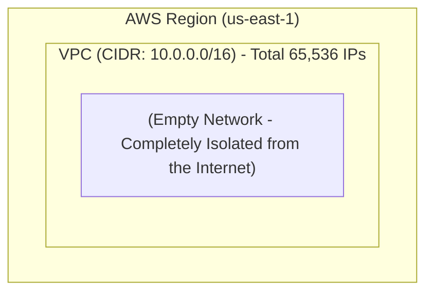
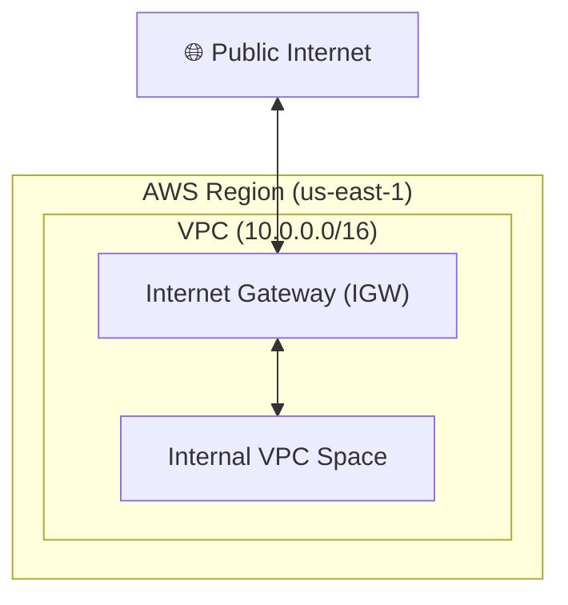
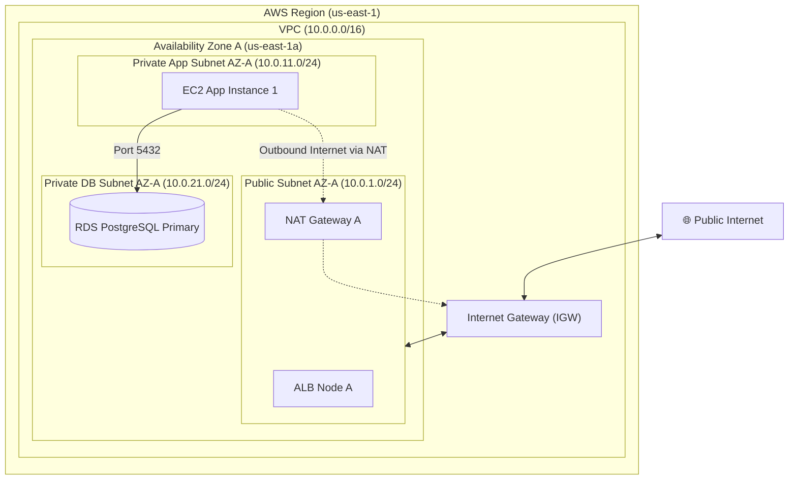
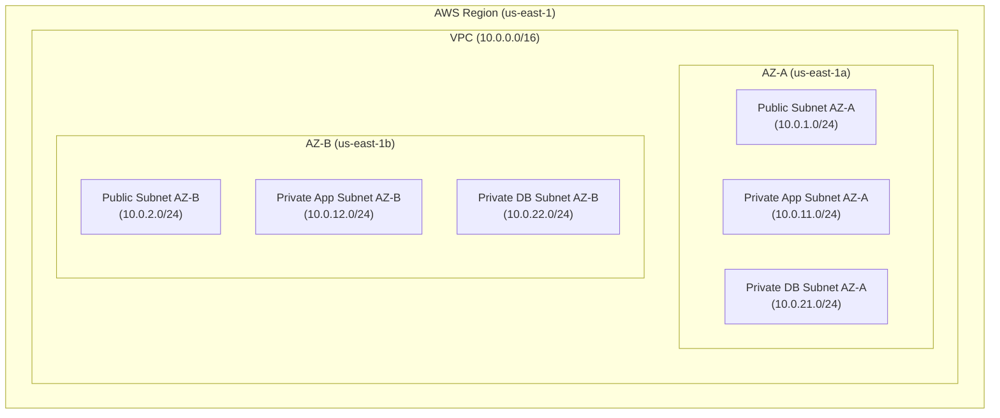
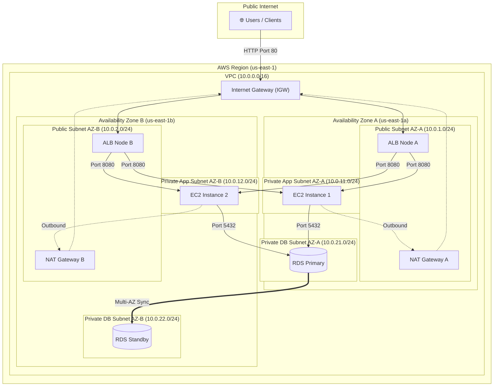

# CloudLab — AWS Architecture Specification

## Stage 1: The Blank VPC (Virtual Private Cloud)

When you open AWS, your account has zero isolated networks. 

The first thing we create is a **VPC** (`10.0.0.0/16`). Think of a VPC as a giant virtual boundary fence inside AWS where all your cloud resources will live.

---

## Stage 2: Connecting the VPC to the Internet (Internet Gateway)

A blank VPC cannot talk to the Internet. To fix this, we attach an **Internet Gateway (IGW)** to the VPC boundary.

---

## Stage 3: Building Availability Zone A (AZ-A)

Now we enter datacenter #1 (**`us-east-1a`**). We divide our IP space into 3 subnets stacked by security level:

1. **Public Subnet AZ-A (`10.0.1.0/24`)**: Connected to IGW. Holds **ALB Node A** and **NAT Gateway A**.
2. **Private App Subnet AZ-A (`10.0.11.0/24`)**: No public IP. Holds **EC2 Instance 1**. Routes outbound traffic through NAT Gateway A.
3. **Private DB Subnet AZ-A (`10.0.21.0/24`)**: Completely isolated. Holds **RDS Primary PostgreSQL**.

---

## Stage 4: Adding Availability Zone B (AZ-B) for High Availability

If datacenter `us-east-1a` catches fire or loses power, our single-AZ system goes down! 

To prevent downtime, we add datacenter #2 (**`us-east-1b`**) and duplicate the exact same subnet structure.

---

## Stage 5: The Final Master Architecture (Complete Traffic Connections)

Now we connect all components across both AZs into a unified, high-availability system:

---

## Subnet & IP Address Allocation Matrix

| Subnet Name | Zone | Subnet Type | CIDR Block | Usable IPs | Internet Route |
| :--- | :--- | :--- | :--- | :--- | :--- |
| `public-subnet-1` | `us-east-1a` | Public | `10.0.1.0/24` | 251 | Internet Gateway |
| `public-subnet-2` | `us-east-1b` | Public | `10.0.2.0/24` | 251 | Internet Gateway |
| `private-app-subnet-1` | `us-east-1a` | Private App | `10.0.11.0/24` | 251 | NAT Gateway |
| `private-app-subnet-2` | `us-east-1b` | Private App | `10.0.12.0/24` | 251 | NAT Gateway |
| `private-db-subnet-1` | `us-east-1a` | Private DB | `10.0.21.0/24` | 251 | None (Isolated) |
| `private-db-subnet-2` | `us-east-1b` | Private DB | `10.0.22.0/24` | 251 | None (Isolated) |
