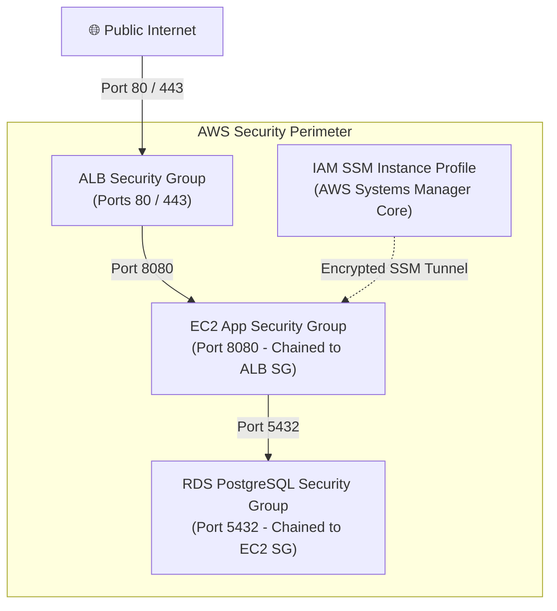

# CloudLab — Security & IAM Architecture Specification

## Overview

CloudLab enforces a **Zero-Trust, 3-Tier Security Perimeter** with **SSH-less IAM administration**. Security rules are defined using dynamic Security Group chaining rather than static IP allocations.



---

## Security Component Specification

### 1. `aws_security_group.alb` — The Front-Door Web Firewall

- **Cloud Component**: Stateful virtual firewall attached directly to the Application Load Balancer (ALB) in Public Subnets.
- **Practical Use**: Acts as the sole public entrypoint for all inbound HTTP/HTTPS web traffic.
- **Allowed Traffic**:
  - **Ingress**: HTTP (Port 80) and HTTPS (Port 443) from `0.0.0.0/0` and `::/0`.
  - **Egress**: Port 8080 outbound to `aws_security_group.ec2`.
- **Risk Mitigation**: Rejects all non-web traffic at the AWS network edge. Ports like 22 (SSH), 3306 (MySQL), 5432 (PostgreSQL), and 3389 (RDP) are completely blocked from the Internet.

---

### 2. `aws_security_group.ec2` — Application Tier Firewall

- **Cloud Component**: Virtual firewall attached to EC2 application instances running in Private App Subnets.
- **Practical Use**: Protects backend application containers from direct Internet exposure using Security Group chaining:
  ```hcl
  security_groups = [aws_security_group.alb.id]
  ```
- **Allowed Traffic**:
  - **Ingress**: Port 8080 **strictly restricted to requests originating from `alb-sg`**.
  - **Egress**: All outbound traffic (`0.0.0.0/0`) via NAT Gateway for OS updates, package management, and Docker pulls.
- **Risk Mitigation**: Prevents attackers from bypassing the ALB to attack backend EC2 servers directly. Direct inbound connections from the Internet to EC2 IP addresses are dropped automatically by AWS firewalls.

---

### 3. `aws_security_group_rule.alb_egress_to_ec2` — Inter-Tier Bridge

- **Cloud Component**: Directional security group rule connecting `alb-sg` to `ec2-sg`.
- **Practical Use**: Permits the Application Load Balancer to forward client HTTP requests to port 8080 on backend EC2 instances.
- **Design Rationale**: Defined as a standalone resource (`aws_security_group_rule`) to eliminate Terraform cyclic dependency deadlocks (`ALB SG needs EC2 SG ID, but EC2 SG needs ALB SG ID`).

---

### 4. `aws_security_group.db` — Database Vault Firewall

- **Cloud Component**: Virtual firewall attached to Amazon RDS (PostgreSQL) in Private DB Subnets.
- **Practical Use**: Locks down the data tier. Restricts database queries strictly to authorized EC2 application servers.
- **Allowed Traffic**:
  - **Ingress**: PostgreSQL (Port 5432) **strictly restricted to `ec2-sg`**.
  - **Egress**: **Zero Egress Rules** (Egress block is omitted).
- **Risk Mitigation**:
  - **Zero Public Access**: Database is unreachable from the public internet or public subnets.
  - **Data Exfiltration Prevention**: Because zero egress is configured, a compromised database server cannot initiate outbound connections or leak data out to external servers.

---

### 5. IAM Role & SSM Instance Profile — SSH-Less Cloud Management

- **Cloud Components**:
  - `aws_iam_role.ec2_ssm`: IAM Role with trust policy for `ec2.amazonaws.com`.
  - `aws_iam_role_policy_attachment.ssm`: Attaches managed policy `AmazonSSMManagedInstanceCore`.
  - `aws_iam_instance_profile.ec2`: IAM container object attached to EC2 virtual machines.
- **Practical Use**: Enables **AWS Systems Manager (SSM) Session Manager** for encrypted browser and CLI terminal access to private EC2 instances without needing SSH keys or Port 22.
- **Risk Mitigation**:
  - **Eliminates Port 22**: Removes SSH from security groups, defeating SSH brute-force attacks.
  - **Eliminates Leaked SSH Keys**: Removes `.pem` keypairs. Authentication is managed via AWS IAM credentials with MFA support and full session recording in CloudWatch/CloudTrail.

---

## Security Matrix

| Security Group | Inbound Ports Allowed | Allowed Source | Outbound Ports Allowed | Target Destination |
| :--- | :--- | :--- | :--- | :--- |
| **`alb-sg`** | 80, 443 | `0.0.0.0/0` (Internet) | 8080 | `ec2-sg` |
| **`ec2-sg`** | 8080 | `alb-sg` ONLY | All (`-1`) | `0.0.0.0/0` (via NAT GW) & Port 5432 to `db-sg` |
| **`db-sg`** | 5432 | `ec2-sg` ONLY | None | None (Isolated) |
